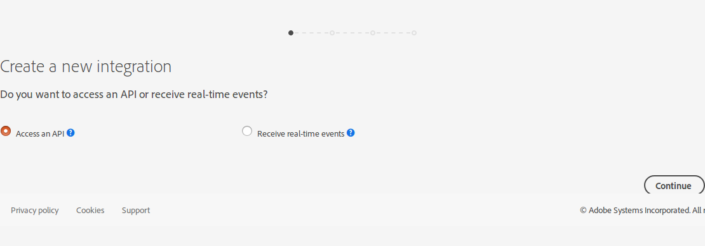
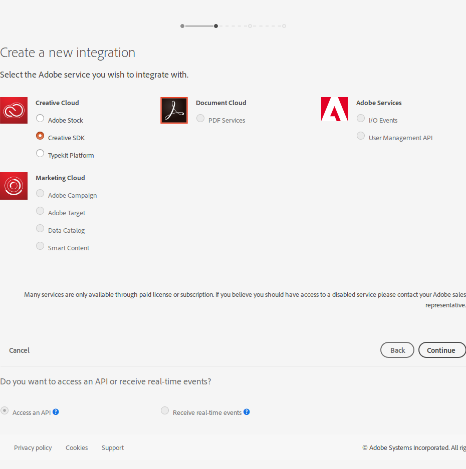
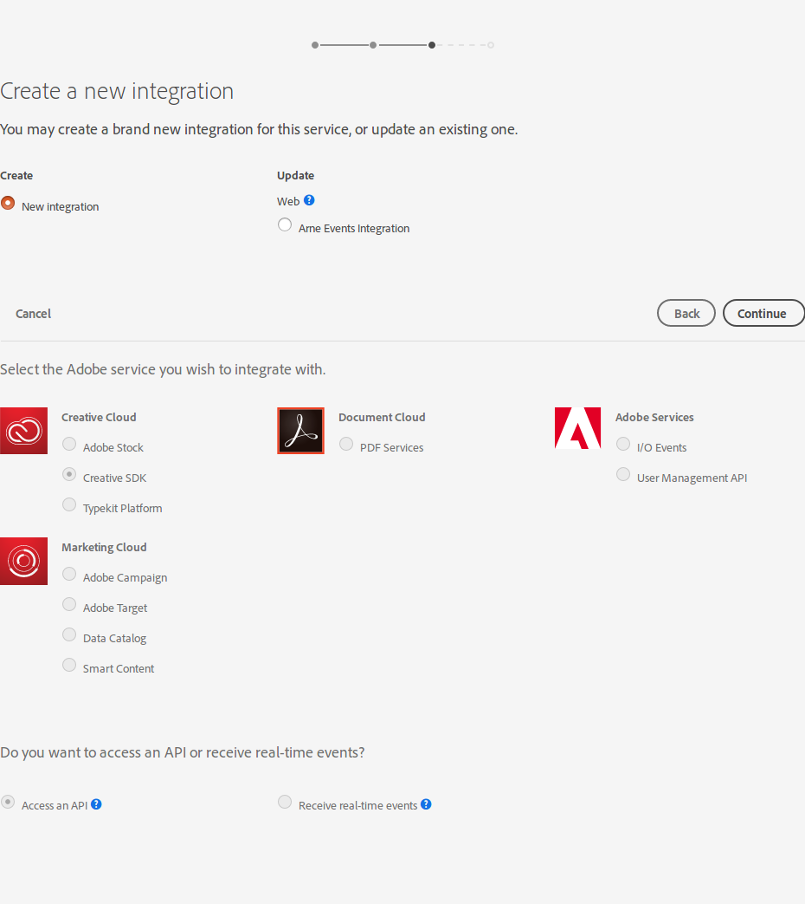
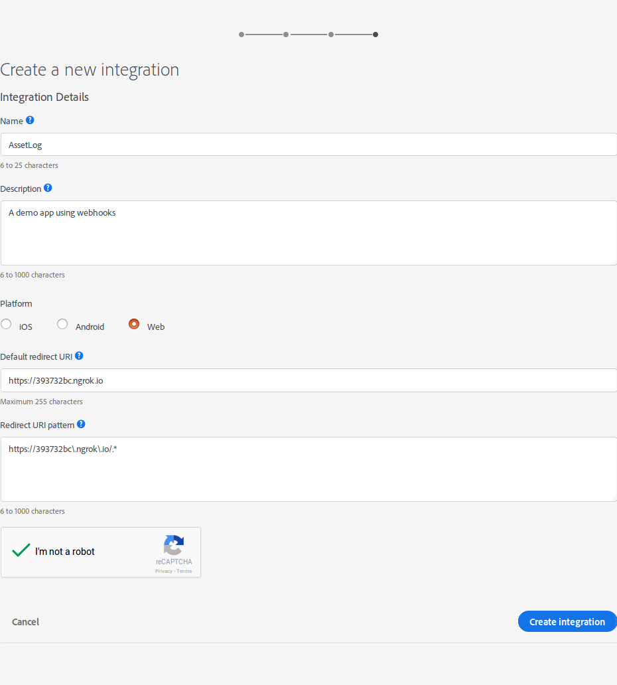
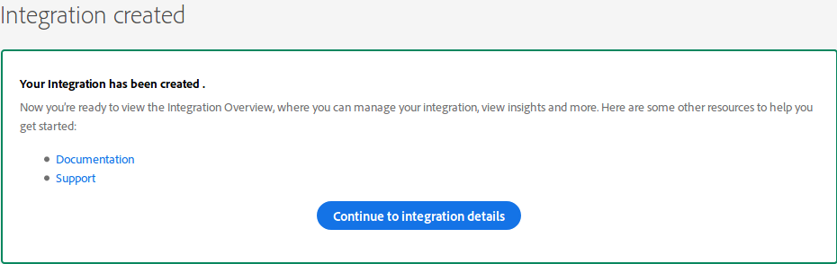
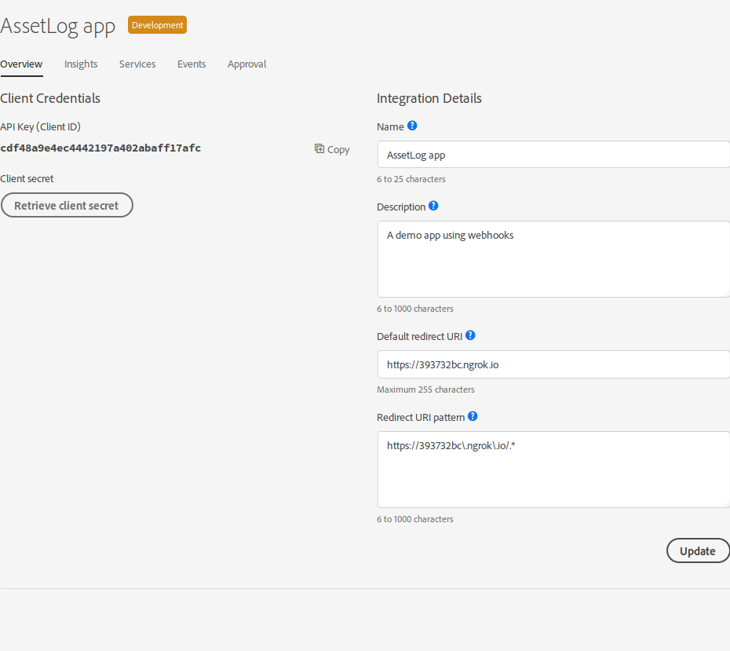
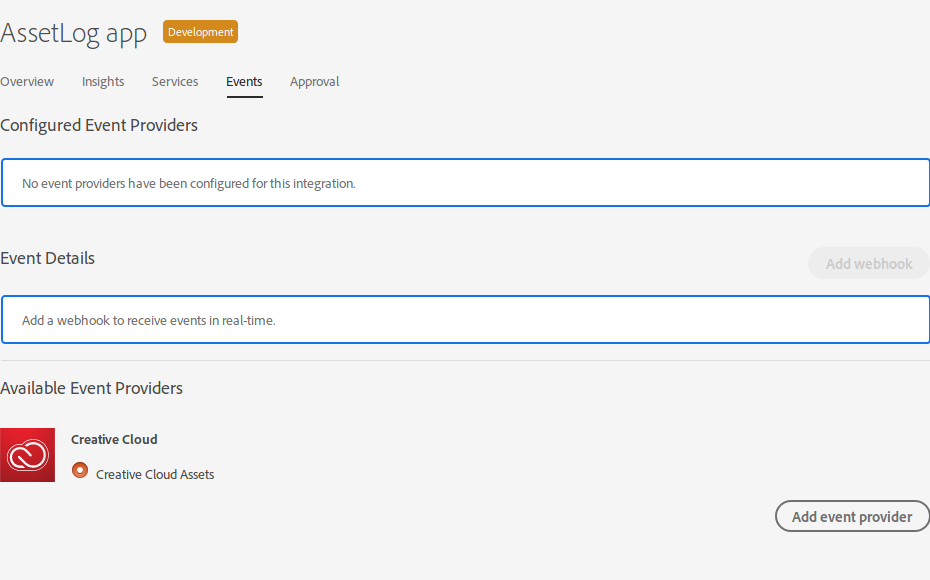
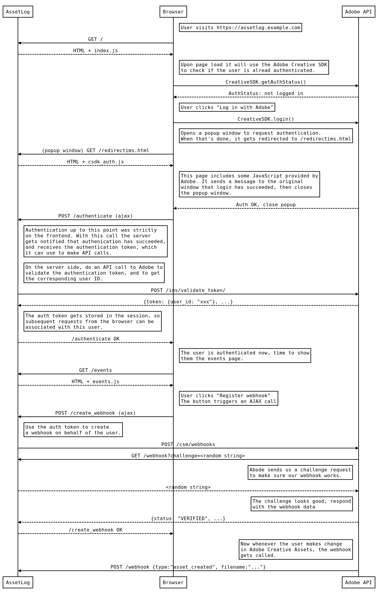

# Assetlog

Keep a log of changes happening on your Adobe Creative Cloud Assets storage.

Sample application for using Adobe Events webhooks.

<!-- START doctoc generated TOC please keep comment here to allow auto update -->
<!-- DON'T EDIT THIS SECTION, INSTEAD RE-RUN doctoc TO UPDATE -->
**Table of Contents**  *generated with [DocToc](https://github.com/thlorenz/doctoc)*

- [Introduction](#introduction)
- [Prerequisites](#prerequisites)
- [Setting up the application locally](#setting-up-the-application-locally)
  - [Start ngrok](#start-ngrok)
  - [Create the integration](#create-the-integration)
  - [Running the app](#running-the-app)
  - [Heroku](#heroku)

<!-- END doctoc generated TOC please keep comment here to allow auto update -->

## Introduction

This is a sample application written in Node.js using the Express web framework. It demonstrates how to use the [Adobe Creative SDK](https://creativesdk.adobe.com/) to [perform authentication](https://creativesdk.adobe.com/docs/web/#/articles/userauthui/index.html), how to programmatically register webhooks to receive events from [Adobe Creative Cloud Assets](https://assets.adobe.com), and how to verify and handle these incoming webhook events.

You can try it out at [https://assetlog.herokuapp.com](https://assetlog.herokuapp.com).

## Prerequisites

You need an Adobe ID, and access to the Adobe I/O Events Beta program ([request form](https://adobeio.typeform.com/to/QvEgPP)).

You need to [Node.js](http://nodejs.org/) installed, version 6.0.0 or later, and [npm](http://npmjs.com/).

To be able to use the Adobe Creative SDK for authentication, and to be able to receive inbound webhook calls, your application needs to be accessible from the open internet (have a public domain name), and use SSL encryption (HTTPS). An easy way to make your local development machine publicly accesible over HTTPS is with [Ngrok](http://ngrok.io/).

Alternatively you can run the app on a hosting service that takes care of these aspects. This document describes how to deploy the app to [Heroku](http://heroku.com/).

## Setting up the application locally

### Start ngrok

Ngrok is a tool that creates a public domain name, and then forwards all HTTP and HTTPS traffic from that domain to a port on your local machine. That way you can run a web application locally, but make it accessible to the outside word.

Do this step first, because you will need to know your public domain name for the next step. Avoid restarting ngrok, because each time you do it will assign you a different domain name, so use a separate terminal window where you can leave ngrok running in the background.

```
ngrok http 5000
```

Make a note of the address you have been assigned. You will need this in the next step, for instance:

```
Forwarding     http://393732bc.ngrok.io -> localhost:5000
Forwarding     https://393732bc.ngrok.io -> localhost:5000
```

### Create the integration

Open the [Adobe I/O Console Integrations Page](https://console.adobe.io/integrations), and click on "New Integration"



Choose "Access an API", and click on "Continue"



Choose "Creative SDK", click "Continue"



Choose "New Integration", click "Continue"



Give your application a name and description. For the callback url, fill in the HTTPS url you got from Ngrok. For the URI pattern, use the same value, but escape the periods in the domain name wit a slash, and add `.*` at the end. This is a regular expression, it must match `https://yourdomain.com/redirectims.html` for the application to work correctly.



You application has been created, click "Continue to Integration Details"

The location in your browser's address bar will now look like `https://console.adobe.io/integrations/49045/32655/overview`. Make note of these two numbers. The first (in this case `49045`) is the *CONSUMER ID*, unique to your Adobe ID. The second is the *APPLICATION ID*, unique for this integration.

Also note the "API Key (Client ID)" and "Client secret".



As a final step, click on the *Events* tab, select "Creative Cloud Assets", and click on "Add Event Provider". You should now see "Creative Cloud Assets" listed under "Configured Event Providers".



### Configure the app

The application reads all its configuration settings from environment variables. Alternatively you can create a `.env` file and set them in there.

Copy `.env.sample` to `.env`, and fill in the blanks, using all the things you took note off while creating the integration. There are comments in the sample file to guide you.

The `HOSTNAME` in this case is the one provided by ngrok. The app needs to know its own location, so that it can correctly register webhooks.

```
HOSTNAME=393532bc.ngrok.io
```

`ADOBE_APPLICATION_ID`, `ADOBE_CONSUMER_ID`, `ADOBE_API_KEY`, and `ADOBE_API_SECRET` can all be found in the integration's overview page (see [Creating the Integration](#create-the-integration))

The `SECRET_SESSION_KEY` is simply a long random string, you can set it to anything. Changing it will invalidate all sessions.

Next install the necessary dependencies. This installs all libraries the application uses under the `node_modules` directory.

```
npm install
```

Finally run the migrations, so the database tables are created. This will connect to the confgured `DATABASE_URL`, and set up the necessary structure. The sample `.env` uses Sqlite as a database, which means you don't need to have a database server configured, it will just use a file on the filesystem.

```
npm run migrate
```

### Run the app

To start the application server, issue. This uses [node-foreman](https://github.com/strongloop/node-foreman) under the hood to run the commands in `Procfile`.

```
npm start
```

This will start the app on port 5000 (or whatever value is set for `PORT` in `.env`), so you can browse to it at [http://localhost:5000](http://localhost:5000). Note that for the Adobe Auth UI to work correctly you need to be running on https (so with SSL encryption), and to actually receive webhooks the app needs to be accessible from outside. This is why previously you started ngrok. Visit the URL that ngrok shows (look for `Forwarding` in the ngrok output), and you should see the app running.

## Deploying the application to Heroku

### Prerequisites

You need the [Heroku CLI](https://devcenter.heroku.com/articles/heroku-cli) installed for this part, and be logged in.

```
$ heroku --version
heroku-cli/6.6.1-010a227 (darwin-x64) node-v7.10.0

$ heroku login
Enter your Heroku credentials.
Email: adam@example.com
Password (typing will be hidden):
Authentication successful.
```

### Creating the app and deploying

Create a new Heroku application. This also adds a `heroku` remote to your git config so you can push code to it. You can give the app a name, in which case it will be accessible as `https://<your-app-name>.herokuapp.com`. If you don't give it a name, heroku will pick one for you

```
$ heroku create <your-app-name>
Creating app... done, ⬢ <your-app-name>
https://<your-app-name>.herokuapp.com/ | https://git.heroku.com/<your-app-name>.git

$ git remote -v
heroku  https://git.heroku.com/<your-app-name>.git (fetch)
heroku  https://git.heroku.com/<your-app-name>.git (push)
```

This time the `HOSTNAME` will be `<your-app-name>.herokuapp.com`.

Add the PostgreSQL add-on, so that there's a database. This will also configure the `DATABASE_URL` environment variable, so the app knows where to connect to.

```
heroku addons:create heroku-postgresql:hobby-dev
```

Deploy the application code to Heroku. This is simply done by pushing to the git remote added by `heroku create`.

```
git push heroku master
```

Run the migrations, this creates the necessary database tables

```
heroku run npm run migrate
```

Now you need to set the necessary environment variables, these are the ones that are listed in the `.env` file. You can do this either one by one, e.g.

```
heroku config:set ADOBE_APPLICATION_ID=123
```

Or you can copy over the values from your `.env` file with the `heroku-config` plugin

```
heroku plugins:install heroku-config
heroku config:push
```

By default this only configures variables which aren't configured yet. Any existing variables it leaves alone. This is good, because you don't want to accidentally overwrite things like `DATABASE_URL` or `PORT`.

If you change values in `.env` and now want to update the variables on Heroku, then you can use the `--overwrite` flag, but make sure the comment out `DATABASE_URL` first!

```
heroku config:push --overwrite
```

Verify that they're all there with `heroku config`. Make sure `HOSTNAME` is the domain name of your heroku app.

Now your app should be up and running. `heroku open` will open it in the browser, with `heroku logs -t` you can follow the server logs.

## Walkthrough


